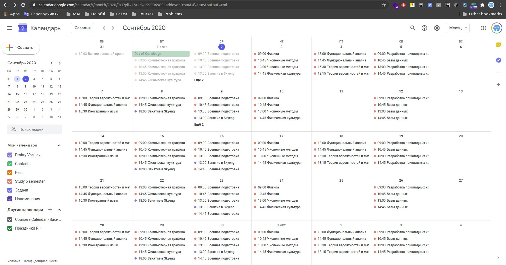

# mai-schedule-export-to-ics

Simple script for creating iCalendar studying schedule MAI :calendar:



# Install & Run

1. Clone this repository

2. Create and run [virtualenv](https://virtualenv.pypa.io/en/latest/)
```bash
virtualenv venv && source ./venv/bin/activate
```

3. Install packages
```bash
pip install -r requirements.txt
```

4. Run program!
```bash
python main.py --group М8О-310Б-18
```

## Command line arguments
- `--out` - Set output file name
- `--group` - Set group id